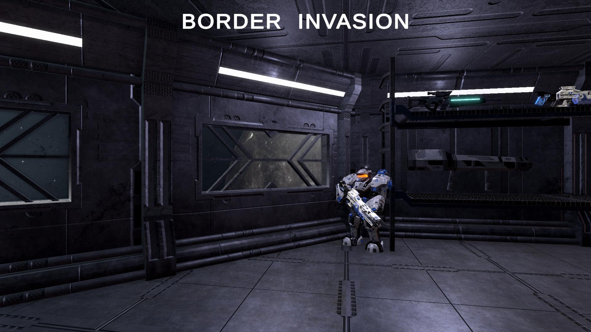

# Border Invasion 邊緣入侵
3D 第三人稱動作射擊與塔防遊戲

## 簡介

建造防禦工事，或是操作角色親自消滅波狀出現的多種敵人，守護基地

打敗敵人時獲得資源，可選擇用來維修基地、建造防禦工事、升級防禦工事、或提升角色的性能

玩家角色有多樣化的武器選擇: 突擊步槍 / 光劍 / 火箭炮 / 狙擊槍

武器有硬鎖定和瞄準鏡功能，輔助玩家瞄準敵人

玩家角色可以用噴射背包飛行、衝刺、或進行光劍的特殊噴射攻擊

遊戲勝利、遊戲失敗、玩家角色重生時有過場動畫

## 操作

esc : 暫停

WASD : 移動  

shift : 噴射衝刺

空白鍵 : 跳躍 / 上升飛行  

ctrl : 下降

滑鼠左鍵 : 攻擊  

滑鼠右鍵 : 武器功能 (鎖定 / 瞄準鏡)  

光劍 + shift + 滑鼠左鍵 : 噴射衝刺攻擊 

B : 建築模式

U : 升級選單

##
[Google Slide 遊戲簡介](https://docs.google.com/presentation/d/1xTmBzZkWXEp4E64Y7dHxtN3xETJmYeABnrlnFAawReo/edit#slide=id.g18a4ebfbffa_0_0)

##
[Demo Video](https://youtu.be/9xAPkn2ET14)

[預告片](https://youtu.be/Co8yCh8LCPM)

[Build](https://drive.google.com/file/d/138z-8g2osn11sogl1USvsPCfLTDfbePr/view?usp=drive_link)
